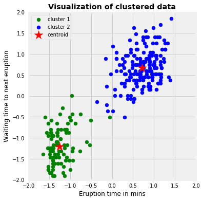

<style>
p.comment {
background-color: #DBDBDB;
padding: 10px;
border: 1px solid black;
margin-left: 0px;
border-radius: 5px;
}
</style>

```{r load.libraries, message = FALSE, warning = FALSE}
library(tidyverse)  # tibble, pipe, etc.
library(readxl)     # read in Excel data directly, in tibble format
library(factoextra) # beautiful cluster-graph with kmeans()
library(knitr)      # R Markdown and html output
library(kableExtra) # pretty html tables
```

\  

# Chunk options

The initial line in a code chunk may include various options. For example, `echo = FALSE` indicates that the code will not be shown in the final document (though any results/output would still be displayed). You use `results = "hide"` to hide the results/output (but here the code would still be displayed). You use `include = FALSE` to have the chunk evaluated, but neither the code nor its output displayed.

etc.

\  

# Example data set

Shotgun lipidomics was applied and 335 single metabolites were measured in two experimental groups with 14 samples in the control group and 14 samples in the treatment group. The single metabolites can be assigned to 15 lipid classes.

Lipid concentrations are given normalized to total lipids: nmol/mg lipid.

**Aim:** Detect significant differences between groups of single fatty acid metabolites (or sum of metabolites).

\  

# Read in data

Typically, data sets are saved in Excel files. Here we read in the data using the function `read_excel()` from the **readxl-R-package**.

Then we apply following steps:

* We have a quick look at the data frame, e.g. using `str()`.

* We re-code the group labels with more clear labels.

* We apply the detection limit of the lab method to define zero values.

* Exclude the columns with sums of lipid classes, calculate here in R.

* We arrange the data frame from wide to long format.

* We export the data as a csv-file.

\  

```{r read.data, message = FALSE, warning = FALSE}
dat <- read_excel("./data/data-lipidomics-28samples.xlsx")

dat[,1:6]

# here I replace k and v in group with "control" and "treatment"
dat <- dat %>% 
   mutate(group = case_when(
     group == "k" ~ "control",
     group == "v" ~ "treatment"))

# here I replace all NAs and zeros with detection limit (= 0.001)
dat <- dat %>% 
  replace(., . == 0 | is.na(.), 0.001)

# transpose data frame to long format
# only select columns with single lipids
dat <- dat %>% 
  dplyr::select(sample, group, `LEG in kg`, `ADFI in g`, contains(":")) %>% 
  gather(key = "lipid", value = "concentration",`PC 14:0_16:0`:`LPG 18:1`)

# export file as .csv (open source data format), only if it was not done yet
# 1 if-case: if (Condition) {TRUE-block}
if (!file.exists("./data/data-lipidomics-28samples.csv"))
  write.csv(dat, file = "./data/data-lipidomics-28samples.csv", row.names = FALSE)
```

\  

# Look at the data

Here we show the data in an awesome html-style Tabel of the **kableExtra-R-package**.

To learn how to generate these tables, you can visit: [link](https://cran.r-project.org/web/packages/kableExtra/vignettes/awesome_table_in_html.html)

\ 

```{r data, message = FALSE, warning = FALSE}
dat %>% 
  arrange(sample) %>% 
  tibble::rowid_to_column("#") %>% 
  kable(caption = "Data set - long format") %>%
  kable_styling(bootstrap_options = c("striped", "hover"), font_size = 10) %>% 
  scroll_box(width = "600px", height = "500px")
```

\  

# Create summary statistics and plots

First look at the differences of the fatty acid classes between the two groups:

```{r data.summary, message = FALSE, warning = FALSE}
dat %>% 
  group_by(lipid,group) %>% 
  summarize(mean_conc    = mean(concentration),
            sd_conc      = sd(concentration)
            )
```

\  

Plotting results, here only the 7 22:6-lipids. We use `facet_wrap()` to plot all individual plots together.

```{r boxplots, message = FALSE, warning = FALSE, fig.width=12, fig.height=10}
dat %>% 
  dplyr::filter(grepl("22:6",lipid)) %>% 
  mutate(lipid = as.factor(lipid)) %>% 
  mutate(lipid = reorder(lipid, -concentration)) %>% 

ggplot(aes(x = group, y = concentration, fill = group))+
  geom_boxplot()+
  facet_wrap(~lipid, ncol = 3, scales = "free_y")+
  scale_fill_manual(values = c("cornflowerblue", "orange"))+
  xlab(label = "")+
  ylab(label = c(expression(paste("Concentration (nmol ", mg^-1, " lipid)"))))+
  theme_bw()+
  theme(legend.position="none")
```

\  

You can also save the plot as png-file:

```{r save.plot, message = FALSE, warning = FALSE, eval = FALSE}
png("./FIG/lipids-226-plot.png", width = 25, height = 30, units = 'cm', res = 300, type='cairo')

dat %>% 
  dplyr::filter(grepl("22:6",lipid)) %>% 
  mutate(lipid = as.factor(lipid)) %>% 
  mutate(lipid = reorder(lipid, -concentration)) %>% 

ggplot(aes(x = group, y = concentration, fill = group))+
  geom_boxplot()+
  facet_wrap(~lipid, ncol = 3, scales = "free_y")+
  scale_fill_manual(values = c("cornflowerblue", "orange"))+
  xlab(label = "")+
  ylab(label = c(expression(paste("Concentration (nmol ", mg^-1, " lipid)"))))+
  theme_bw()+
  theme(legend.position="none")

dev.off()
```

\ 

# Multiple *t*-tests

Metabolomics data often have a log-normal distribution, i.e. the log(data) is normally distributed. We just assume this here (without any test).

We extract the *p*-values from the test results. Use `?t.test` to look at the structure of the listed results.

```{r mult.test, message = FALSE, warning = FALSE}
p.val <- dat %>% 
  group_by(lipid) %>% 
  summarise(p.wil       = wilcox.test(concentration~group)$p.value,
            p.ttest.log = t.test(log(concentration)~group)$p.value
            ) %>% 
  arrange(p.ttest.log)

# quick look at the generated p values
p.val
```

\  

# False Discovery Rate (FDR)

<div class="alert alert-info">
  <strong>Attention!</strong> Modern high-throughput technologies (micro-array data, gene expressions, metabolomics data, *etc.*) generate high-dimensional data: $p>>n$.
</div>

## Some theory

<p class="comment">
How do we control the error rates in multiple comparisons?
One way is to control the **familywise type 1 error rate (FWER)**, i.e. the probability of making at least one false rejection of a null hypothesis. The simplest adjustment is the Bonferroni correction, where we define a particular comparison as statistically significant only when the *p*-value is less than alpha (often 0.05) divided by the number of all comparisons:
$$p<\frac{\alpha}{m}$$
This approach is very conservative as this threshold will be very small the more comparisons are made.
**False discovery rate (FDR)** controlling procedures (e.g. Benjamini-Hochberg, BH) instead control the proportion of wrongly rejected null hypotheses amongst those that are rejected. The FDR methods are more powerful than the FWER methods and are the method of choice for high-dimensional data.
</p>

\ 

## Our example

The data set obtained here using shotgun lipidomics is a typical high-dimensional data set, i.e. hundreds of lipid concentrations were measured in much less independent replicates, 335 lipid species in a control group with 14 samples and a treatment group with 14 samples.
Accordingly, we made 335 comparisons, i.e. 335 individual *t*-tests were performed. Have a quick look at the distribution of the 335 *p*- values.

\  

```{r, message=FALSE, warning=FALSE}
sum(p.val$p.ttest.log<0.05)

hist(p.val$p.ttest.log,breaks=seq(0,1,.05))
```

\  

*p*-values are random variables. Mathematically, one can demonstrate that under the null hypothesis (and some assumptions are met, in this case, the test statistic *t* follows standard normal distribution), *p*-values follow a uniform (0,1) distribution.

There are 222 of the 335 lipids with a *p*-value < 0.05, have all of them statistically different concentrations in treatment vs. control? **NO!** We need to correct for the multiple comparisons.

One way is to limit the FWER, e.g. by applying the Bonferroni adjustment, i.e. to decrease the individual error rate to:

$$p < \frac{\alpha}{m} = \frac{0.05}{335} = 0.000149$$

As the Bonferroni approach is very conservative, we applied a method controlling the **False Discovery Rate (FDR)** and limit the number of false positives to some value among all significant features, here to 5%. 

We can use a function from base R `p.adjust()`:

\  

```{r pvals, message=FALSE, warning=FALSE}
p.adj.BH <- p.adjust(p.val$p.ttest.log, method="fdr")

# p values not adjusted
sum(p.val$p.ttest.log < 0.05)
# pvalues with Bonferroni adjustment
sum(p.val$p.ttest.log < 0.05/335)
# pvalues with FDR adjustment
sum(p.adj.BH < 0.05)
```

\  

# K-means clustering

## Some theory

<p class="comment">
*K-means clustering* is a popular **unsupervised machine learning algorithm** for partitioning a given data set into a set of *k* groups. The number *k* needs to be pre-specified. The objects within the same cluster are as similar as possible, whereas objects from different clusters are as dissimilar as possible. Each cluster is represented by its centroid, i.e the mean of points assigned to the cluster.
</p>

\  

```{r kmeans.schematic, echo=FALSE, out.width='40%', fig.align='center', fig.cap='https://towardsdatascience.com/k-means-clustering-algorithm-applications-evaluation-methods-and-drawbacks'}

``` 

\  

The k-means algorithm can be summarized as follow:
\  

<div class="alert alert-info">
  1. Specify number of clusters K.
  2. Initialize centroids by first shuffling the dataset and then **randomly selecting** K data points for the centroids without replacement.
  3. Compute the sum of the squared distance between data points and all centroids and assign each data point to the closest cluster (centroid).
  4. Compute the centroids for the new clusters by taking the average of the all data points that belong to each cluster.
  5. Iteration, iteration, iteration... until the assignment of data points to clusters is not changing.
</div>

\  

The standard R function for k-means clustering is `kmeans()` from the **stats-R-package** (already part of base R):

\  

```{r kmeans.func, eval = FALSE}
kmeans(x, centers, iter.max = 10, nstart = 25,
       algorithm = c("Hartigan-Wong", "Lloyd", "Forgy",
                     "MacQueen"), trace=FALSE)
```

\  

**Arguments:**

* `x`: numeric matrix, numeric data frame or a numeric vector
* `centers`: Possible values are the number of clusters (k) or a set of initial (distinct) cluster centers. If a number, a random set of (distinct) rows in x is chosen as the initial centers.
* `iter.max`: The maximum number of iterations allowed. Default value is 10.
* `nstart`: The number of random starting partitions when centers is a number. Trying nstart = 25 is often recommended.

<div class="alert alert-info">
As the final result of k-means clustering result is sensitive to the random starting assignments, we specify nstart = 25. This means that R will try 25 different random starting assignments and then select the best results corresponding to the one with the lowest within cluster variation. The default value of nstart in R is one. But, it’s strongly recommended to compute k-means clustering with a large value of nstart such as 25 or 50, in order to have a more stable result.
</div>

\  

## Computing k-means clustering

The `kmeans()` function requires a matrix of variables, i.e. a wide data table. You can use the function `spread()`. Here we also scale the data.

\  

```{r, message=FALSE, warning=FALSE}
dat.wide <- dat %>% 
  spread(lipid, concentration) %>%
  dplyr::select(contains(":"))

# Scaling the data
dat.wide.scaled <- scale(dat.wide) 
```

\  

<div class="alert alert-info">
As k-means clustering algorithm starts with k randomly selected centroids, it’s always recommended to use the `set.seed()` function in order to set a seed for R’s random number generator. The aim is to make the results **reproducible !!**
</div>

\  

```{r seed, echo=FALSE, out.width='60%', fig.align='center', fig.cap='https://www.digminecraft.com/getting_started/how_to_create_world_with_seed.php'}

``` 

\  

```{r}
# Compute k-means with k = 2
set.seed(42)
km.res <- kmeans(dat.wide.scaled, centers = 2, nstart = 25)
```

\  

The `kmeans()` function returns a **list** of components, including:

* `cluster`: A vector of integers (from 1:k) indicating the cluster to which each point is allocated
* `centers`: A matrix of cluster centers (cluster means)
* `totss`: The total sum of squares (TSS), it measures the total variance in the data.
* `withinss`: Vector of within-cluster sum of squares, one component per cluster
* `tot.withinss`: Total within-cluster sum of squares, i.e. sum of withinss
* `betweenss`: The between-cluster sum of squares, i.e. totss minus tot.withinss
* `size`: The number of observations in each cluster

These components can be accessed as follow:

```{r}
# structure of the results (a list)
str(km.res)

# Cluster number for each of the observations
km.res$cluster

# Cluster size
km.res$size

# Cluster means
km.res$centers[, 1:5]
```

\  

## Visualizing k-means clusters

We could visualize the data in a scatter plot with coloring each data point according to its cluster assignment. 

<div class="alert alert-info">
<bold>Attention!!</bold> We have a multi-dimensional data set, a solution is to reduce dimensionalit with Principal Component Analysis (PCA) and to plot data points according to the first two principal components coordinates.
</div>

The **factoextra-R-package** provides ggplot2-based elegant visualization of partitioning methods including kmeans! Here we use the function `fviz_cluster()`.

\  

```{r}
fviz_cluster(km.res, data = dat.wide.scaled,
             palette = c("firebrick","cornflowerblue"),
             ggtheme = theme_minimal(),
             main = "Partitioning Clustering Plot"
             )
```

\  

**THE END**

```{r session.info}
sessionInfo()
```

\  
\  

```{r twitter, echo=FALSE, out.width='60%', fig.align='center'}

``` 
